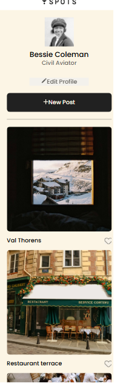

# Spots

Welcome to Spots, a sleek, responsive image-sharing service designed for seamless uploading, browsing, and interaction. Built with modern web technologies, this platform ensures a smooth experience across all devices.

## Key Elements & Features

Core Develpment

- Semantic HTML5 for Clean, accessible markup for better SEO and readability.
- Flexbox & CSS Grid for Adaptive layouts that adjust to any screen size.

Styling & Effects

- BEM Naming Convention for Modular, reusable CSS for easy maintenance.
- CSS Custom Properties for Variables for consistent colors, spacing, and themes.

### Link to video describing project

https://drive.google.com/file/d/1Y5lGA71SQHb3IHWxdkou-fWwnOTCjHZ9/view?usp=sharing

[Deployment link](https://mdejesus931.github.io/se_project_spots/)

